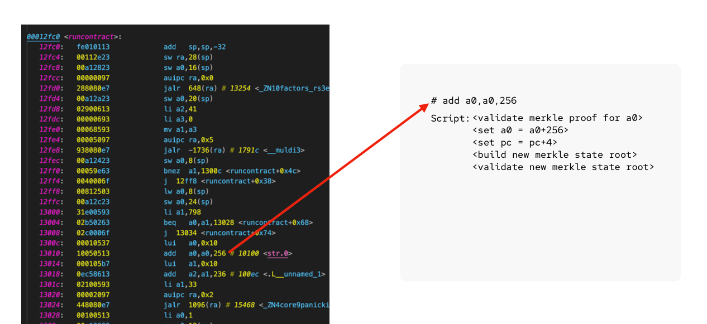
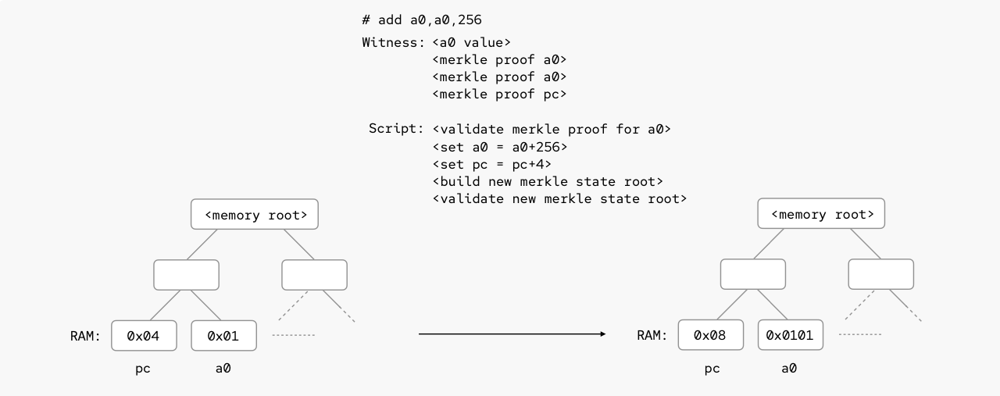

# ZK verification
A few months ago, I held [a presentation](btcplusplus.pdf) at [bitcoin++ in
Austin, Texas](https://btcplusplus.dev/conf/atx24), a conference dedicated to
Bitcoin scripting and possible future improvements to Bitcoin contracting. The
talk was about how we can use covenant primitives in Bitcoin script to verify
RISC-V execution, and together with the optimistic exection paradigm enable
advanced and practical smart contracting on layer1.

Towards the end of the presentation I showed a ZK verifer written in Rust that
gets compiled down to Bitcoin script, and use it to verify an execution of it
in Script.

In this post I will walk through how this works, and what it means, and with
instructions and code hopoefully easy enough so you can start playing around
with it yourselves.

## Key concepts
The optimistic verification method we are utilizing is based on the
[Merkelize-all-the-things (MATT)](https://merkle.fun/) framework that I've
[written about
earlier](https://github.com/halseth/mattlab/blob/main/docs/challenge.md).
Since this is just a more specific use case of that general framework, I will
refer to that for a more detailed break down. High level: we commit to the
execution trace of an arbitrary computation using a merkle tree, and utilize
fraud proofs to penalize a player performing the execution incorrectly.

In this post we'll only explore the RISC-V binary verification in Script, and
refer to the above resources for more details on the full challenge-response
part of MATT.

### Rust and RISC-V
We can write the contract much like we would write any other Rust project, as
long as we adhere to the limitations of our limited bare-metal target.

```rust
#[no_mangle]
pub extern "C" fn runcontract(_: u32) -> u32 {
    let a = read_input();
    let b: u32 = some_function(a)

    env::write(&b);
    return 0
}
```

The way we commit to the Rust program is by compiling it into RISC-V assembly,
and using Bitcoin Script to emulate how each of the RISC-V opcodes alter the
memory of the machine. The scripts are then assembled into a Taptree and put on
chain as part of the contract setup.



After the RISC-V program has been translated to Script (1), we can run its
binary with some input on a regular RISC-V virtual machine, and trace the
execution (2). Tracing the execution means taking a snapshot of the machine's
memory before and after each machine instruction, and committing to it using a
merkle tree.



Note that all players involved in the optimistic execution of the contract can
run it off-chain on their own high-performant RISC-V VM. The Bitcoin Script
verification is only performed if fraud is detected and for a single
instruction in the trace. This means that the Script equivalent of the assembly
instruction does not need to be very cheap to execute on-chain, as long as it
_can_ be executed on-chain.

We'll use the [RISC Zero](https://github.com/risc0/risc0) virtual machine for
running and tracing our produced binary.

### Elftrace
Now that the high-level concepts have been presented, let me present
[Elftrace](https://github.com/halseth/elftrace).  Elftrace is a
proof-of-concept implementation of the above mentioned steps (1) and (2). We'll
use it to both create the Scripts used for execution verification, as well as
tracing the program.

### Tapsim
[Tapsim](https://github.com/halseth/tapsim) is a Bitcoin Script debugger with
support for the opcodes `OP_CAT` and `OP_CHECKCONTRACTVERIFY`. We'll use this
to execute the verification scripts later in this post.

## Writing a ZK verifier
To show how easily we can write a ZK verifier, we'll go ahead and create a Rust
project and import one of the well known STARK libraries,
[Winterfell](https://github.com/facebook/winterfell). We'll also use one of
Wintefell's examples, proving we can correctly compute [the nth term of the
Fibonacci sequence](https://github.com/facebook/winterfell/tree/main/examples#fibonacci-sequence). 

Check out the project in
[zkfibonacci-rs](https://github.com/halseth/zkfibonacci-rs), which cointains
the boilerplate and actual program code. Some interesting details:

- `.cargo/config.toml`: The build target is specified as
  "riscv32i-unknown-none-elf". This instructs the Rust compiler to build a
  binary for a RISC-V 32-bit bare-metal architecture.
- `src/asm/init.s`: Since we are targetting a bare-metal platform, we need an
  inline assembly entry point to start up the program.
- Folders `src/env+serde+utils`: Code grabbed from the RISC0 project for working
  with input-output when running on the RISC0 VM.
- `src/air.rs`: The fibonacci sequence verification logic copied from Winterfell.
- `src/main.rs`: The `runcontract` function is our actual contract.

With the boilerplate in place, and the example copied from Winterfell, there is
not much to it. We'll read the ZK proof from STDIO, call the Winterfell
verification logic with the proof, and write 0 to STDOUT if the proof checks
out.

Now we can compile it
```
cargo build --release
```

and the resulting binary is located in
`target/riscv32i-unknown-none-elf/release/zkfibonacci-rs`.

## Tracing
Now that we have the binary at hand, let's run it with a valid ZK proof as
input and trace the execution! Since we copied the Fibonacci verification code
directly from Winterfell, we can use the prover found in that example to
generate the proof (we use a version that prints out the proof on the command
line):

```
git clone git@github.com:halseth/winterfell.git
cd winterfell 
git checkout c8aa78cc9842d0edcd211f87dddd97898495936d
cargo build --release
./target/release/winterfell --hash_fn blake3_192 fib -n 16
```

Now that we got the proof, we can pass it as input to the program, and run it
on our VM to generate a trace.

```
git clone git@github.com:halseth/elftrace.git
cd elfrace
cargo run --release  -- --binary <path to>/zkfibonacci-rs/target/riscv32i-unknown-none-elf/release/zkfibonacci-rs --input <proof hex> --output 00
```

This should produce an output like 
```
final root[32408382]=304bf600142a48a004781316c62c809429bb4cc4bc9315c82262b27f043f9f50
```

which is the final merkle root committing to the executional trace. When using
MATT as a way of writing on-chain smart contracts, this is what the runner of
the smart contract will have to put on-chain together with the inputs to the
contract (in this case that is the ZK proof). If the computation was done
correctly, each step of the computation will together form the merkle root and
will be verifiable by anybody having access to the program.

## Verification
Being a participant in this setup, one will have access to the source code and
can observe the proofs and traces put on-chain. Let's say we observe someone
cheating, that is they put up a ZK proof that we believe can't be valid. In
this case we'll challenge them and find a step in the trace we believe was
executed incorrectly.

Let's say we have identified step 10 to be incorrect. Having access to the
program, we can inspect the Bitcoin verification script for this step:

```
cargo run --release  -- --binary <path to>/zkfibonacci-rs/target/riscv32i-unknown-none-elf/release/zkfibonacci-rs --input <proof hex> --output 00 --write-step 10
```

When this completes, you will see the script committed, and can execute it
with Tapsim using the trace commitments: 

```
tapsim execute --script "trace/script/pc_5adb8_script_0.txt"  --witness "trace/witness/ins_000a_0_pc_5adb8_witness.txt" --tagfile "trace/tags/ins_000a_0_pc_5adb8_tags.json" --inputkey "`tweak --merkle "\`cat trace/commitment/ins_000a_0_pc_5adb8_commitment.txt\`" --key "nums" | sed -n 4p | awk -F" " '{print $2}'`"
```

This is the script that the prover will have to be able to execute in order to
show the execution was performed correctly off-chain. Note however, that we
wouldn't actually expect the prover to be able to execute it at this point,
because wehy would he then be challenged in the first place?

## Conclusion
We've shown an example of how we can write a ZK verifier in Rust, compile it
for a RISC-V target, and use Bitcoin Script to verify its execution. In order
to achieve this we need a covenant like `OP_CHECKCONTRACTVERIFY` to carry state
across transactions. To make this efficient on-chain the verification must be
embodied in a challenge-response game and disincentivize executing the
expensive scripts.
